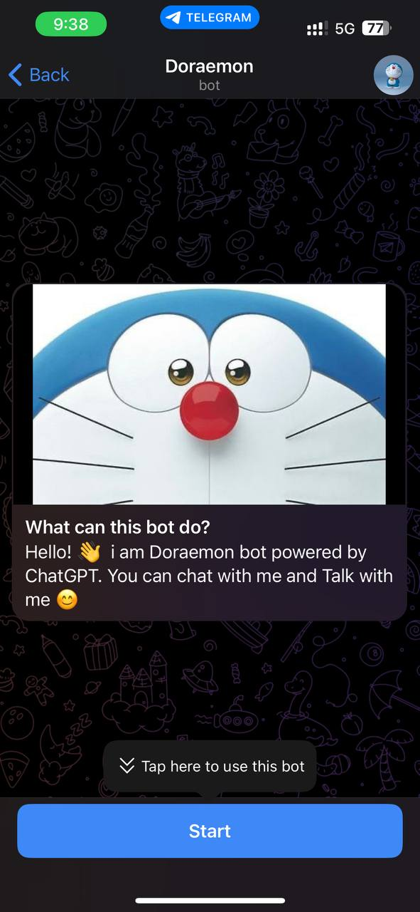
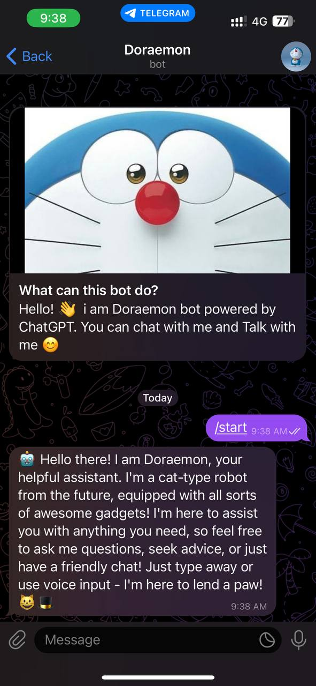
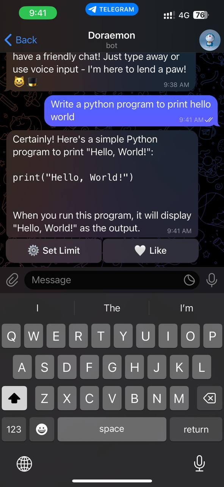
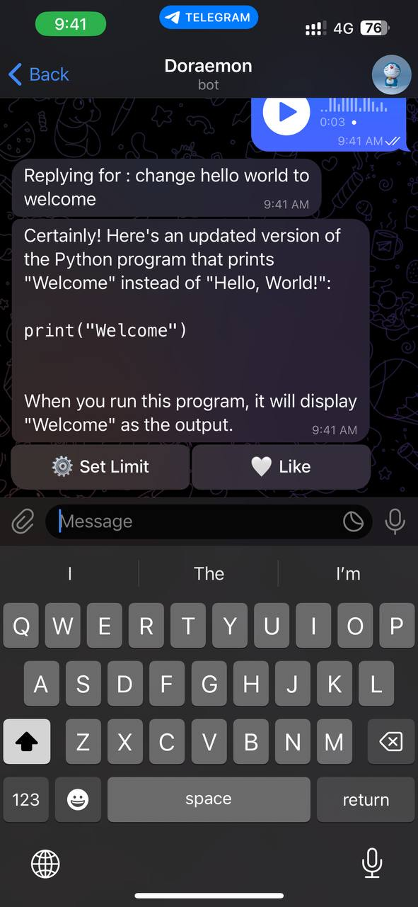

# <p align="center">[**DoraemonGPTBot**](https://t.me/DoraemonGPTBot) (Version 1.0.0)

- <p align="center">An adaptable Python-based ChatGPT implementation for Telegram bots, supporting seamless communication through text and voice inputs.</p>


## **Get Started**

- [File Structure](#file-structure)
- [Environmental Variables](#environmental-variables)
- [Run in Docker](#run-in-docker)
- [Run in python](#run-in-python)
- [Sample Chats](#sample-chats)
- [License](#license)

### Git clone

<p> Use below command to clone this repository.</p>

``` 
git clone https://github.com/codesperfect/DoraemonGPTBot.git
```

## **File Structure**

```
.
├── .env
├── Dockerfile
├── Readme.md
├── bot.py
├── db.py
├── requirements.txt
├── static
│   └── img
│       ├── 0.jpg
│       ├── 1.jpg
│       ├── 2.jpg
│       ├── 3.jpg
│       └── doraemon.png
└── voices
```

## **Environmental Variables**

<p>In <a color="blue">.env</a> file you can see variables given below</p>

```
OPENAI_API = "<OPENAI_API>" 
```
Replace ```<OPENAI_API>``` with your openai api key

<br>

```
TELEGRAMBOT_TOKEN = "<TELEGRAM_BOT_TOKEN>"
```
Replace ```<TELEGRAM_BOT_TOKEN>``` with your openai api key. You can create new bot here [BotFather](https://t.me/BotFather).

<br>

```
MONGODB = "<MONGODB_URL>"
```
Replace ```<MONGODB_URL>``` with your mongodb URL. You can create MongoDB Url here [MongoDB](https://mongodb.com).

<br>

```
GENE = "<BOT_DESCRIPTION>"
```
Replace ```<BOT_DESCRIPTION>``` with your bot description like ''Your name is jarvis and <your_name> is your best friend who created you".

## **Run in Docker**

Use the below code to run this bot in docker.


```
# clone repository
git clone https://github.com/codesperfect/DoraemonGPTBot.git

cd DoraemonGPTBot
```

Follow [Environmental variables](#environmental-variables) and execute the code 

```
docker image build -t gptbot:0.0.1 .
```
Replace ```gptbot``` with your own name for the container.

```
docker run gptbot
```

## **Run in Python**

Use the below code to run this bot in linux.


```
# clone repository
git clone https://github.com/codesperfect/DoraemonGPTBot.git

cd DoraemonGPTBot
```

Follow [Environmental variables](#environmental-variables) and execute the code 

```
python -m pip install -r requirements.txt

python bot.py
```

you can also try with ```python3```.

# **Sample Chats**

### **Start Page**


<br>

### **Bot introduce itself**


<br>

### **Responsing for Text Input**


<br>

### **Responsing for Voice Input**


## **License**

MIT License

Copyright (c) 2023 M Praveen

Permission is hereby granted, free of charge, to any person obtaining a copy
of this software and associated documentation files (the "Software"), to deal
in the Software without restriction, including without limitation the rights
to use, copy, modify, merge, publish, distribute, sublicense, and/or sell
copies of the Software, and to permit persons to whom the Software is
furnished to do so, subject to the following conditions:

The above copyright notice and this permission notice shall be included in all
copies or substantial portions of the Software.

THE SOFTWARE IS PROVIDED "AS IS", WITHOUT WARRANTY OF ANY KIND, EXPRESS OR
IMPLIED, INCLUDING BUT NOT LIMITED TO THE WARRANTIES OF MERCHANTABILITY,
FITNESS FOR A PARTICULAR PURPOSE AND NONINFRINGEMENT. IN NO EVENT SHALL THE
AUTHORS OR COPYRIGHT HOLDERS BE LIABLE FOR ANY CLAIM, DAMAGES OR OTHER
LIABILITY, WHETHER IN AN ACTION OF CONTRACT, TORT OR OTHERWISE, ARISING FROM,
OUT OF OR IN CONNECTION WITH THE SOFTWARE OR THE USE OR OTHER DEALINGS IN THE
SOFTWARE.

---

**THANK YOU :)**